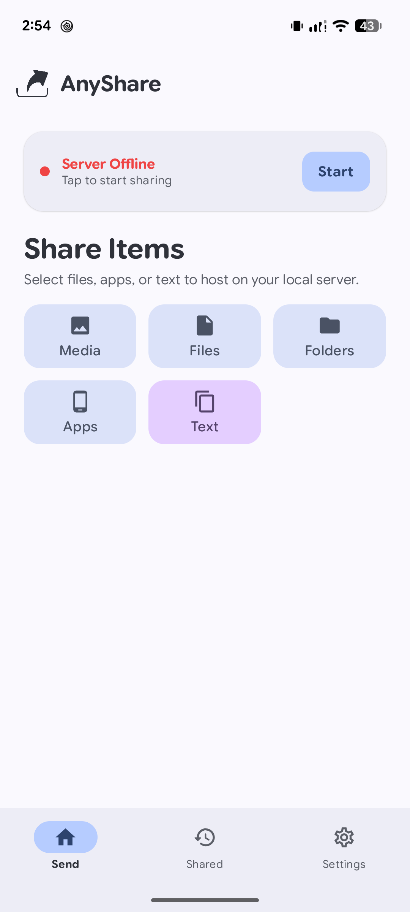
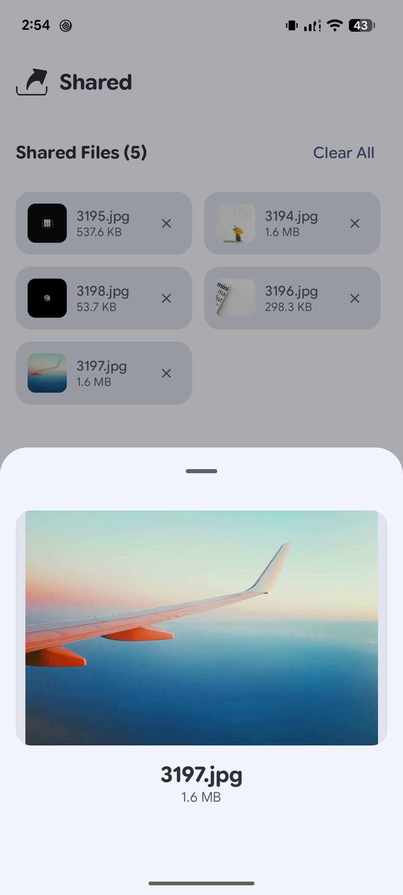
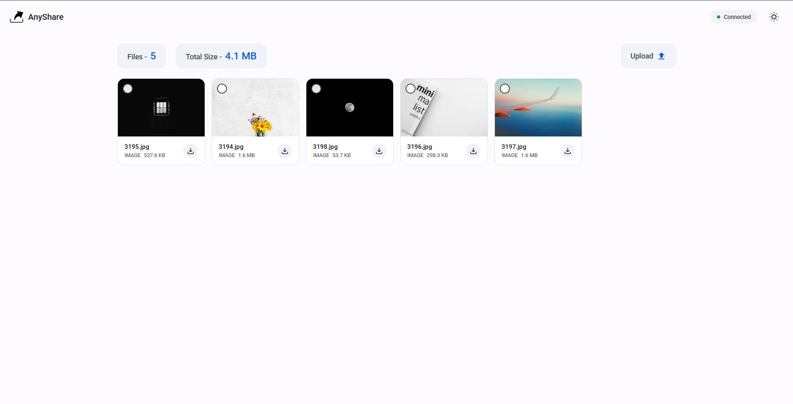

  
  <h1>AnyShare - Stream</h1>
  
<strong>Blazing-fast, offline file sharing for Android — no internet, no cloud, no tracking. Stream your movies locally.</strong>

  

    
    
  

  

    
    
    
  

---

**AnyShare** is a free, open-source Android app that lets you share files with any device on your local network — no internet required. Your phone hosts a clean web server; anyone on the same Wi-Fi opens a browser, types the URL, and downloads or uploads files instantly. No app needed on the other end.

---

## 📸 Screenshots

  <table>
    <tr>
      <td align="center">
        
         <b>Home Screen</b>
      </td>
      <td align="center">
        
         <b>Shared Files</b>
      </td>
      <td align="center">
        
         <b>Web UI (Browser)</b>
      </td>
    </tr>
  </table>

> **To add screenshots:** Create a `docs/screenshots/` folder in the repo root and add `screenshot_home.png`, `screenshot_files.png`, and `screenshot_webui.png`.

---

## ✨ Features

- 🚀 **Blazing Fast** — Transfers run at full local Wi-Fi speed with no internet routing or cloud middlemen
- 🌐 **Universal Web UI** — Any browser on any device (PC, iPhone, tablet) can browse, download, and upload files
- 🖱️ **Drag & Drop Upload** — On desktop, drag files straight into the browser to send them to your phone
- 🔒 **PIN Protection** — Optional 4-digit PIN locks your server so only trusted devices connect
- 🔐 **End-to-End Encryption** — Optional AES-256-GCM encryption for extra-sensitive transfers
- 📱 **Deep Android Integration** — Share from any app via the native Share Menu; Quick Settings Tile & Home Screen Widget
- 📺 **In-Browser Streaming** — Stream video and audio directly in the browser without downloading
- 📂 **Share Anything** — Files, folders, multiple items, APKs, and clipboard text
- 🎨 **Material You Design** — Dynamic colors, dark mode, smooth animations built with Jetpack Compose

---

## 📥 Download

**[⬇️ Download AnyShare-v1.3.0.apk](https://github.com/Kaifazad/AnyShare/releases/latest)**

1. Download the APK from the Releases page
2. Open the file on your Android phone
3. Enable **"Install from unknown sources"** if prompted and install

**Minimum:** Android 8.0 (API 26)

---

## 🛠️ How It Works

1. **Start the server** — Open AnyShare and tap the Start button. The app shows you a local URL (e.g. `http://192.168.1.5:8080`)
2. **Connect** — Make sure the receiving device is on the same Wi-Fi or hotspot
3. **Open the browser** — Type the URL into any browser on the receiving device
4. **Transfer files** — Browse and download shared files, or drag & drop files to upload back to your phone

---

## 💻 Tech Stack

| Layer | Technology |
|---|---|
| Language | 100% Kotlin |
| UI | Jetpack Compose + Material 3 (Material You) |
| Architecture | MVVM + Kotlin Coroutines & Flow |
| Local Server | NanoHTTPD (embedded HTTP server) |
| Encryption | AES-256-GCM (end-to-end) |
| Preferences | DataStore |
| Media | Coil (images) + Media3 ExoPlayer (video) |
| Web UI | Vanilla HTML / CSS / JS |

---

## 🤝 Contributing

Contributions, issues, and feature requests are welcome! Check the [issues page](https://github.com/Kaifazad/AnyShare/issues) or read [CONTRIBUTING.md](CONTRIBUTING.md).

1. Fork the repo
2. Create a feature branch: `git checkout -b feature/my-feature`
3. Commit your changes: `git commit -m 'Add my feature'`
4. Push: `git push origin feature/my-feature`
5. Open a Pull Request

---

## 👤 Author

**Kaif Azad**
- GitHub: [@Kaifazad](https://github.com/Kaifazad)
- Instagram: [@kaif.azad](https://instagram.com/kaif.azad)
- Website: [anyshare.kaifazad.in](https://anyshare.kaifazad.in)

---

## 📝 License

Distributed under the MIT License. See [LICENSE](LICENSE) for details.
