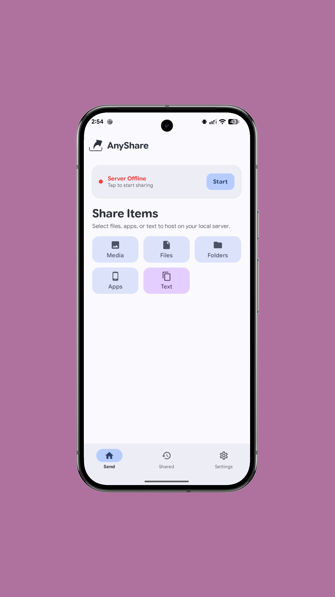
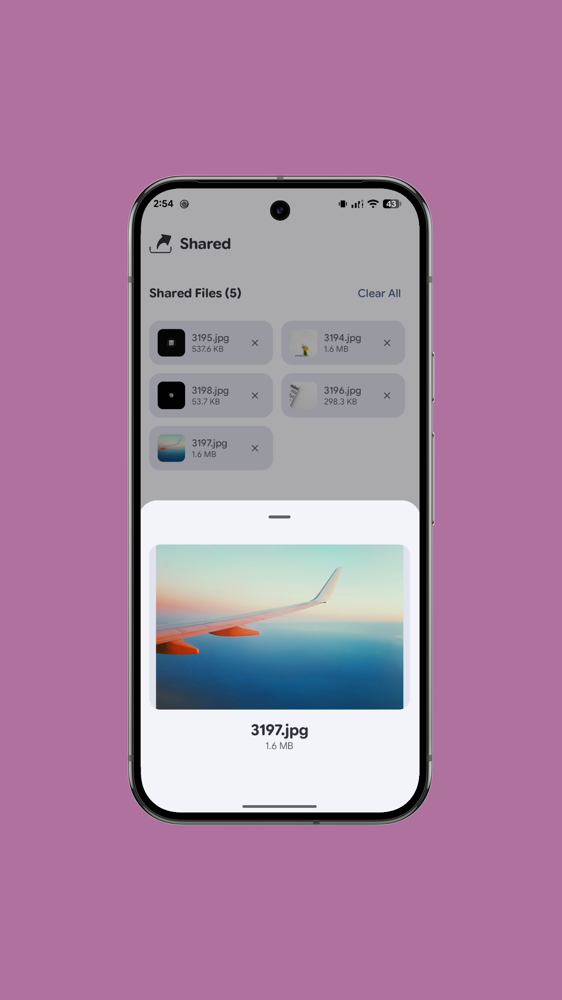
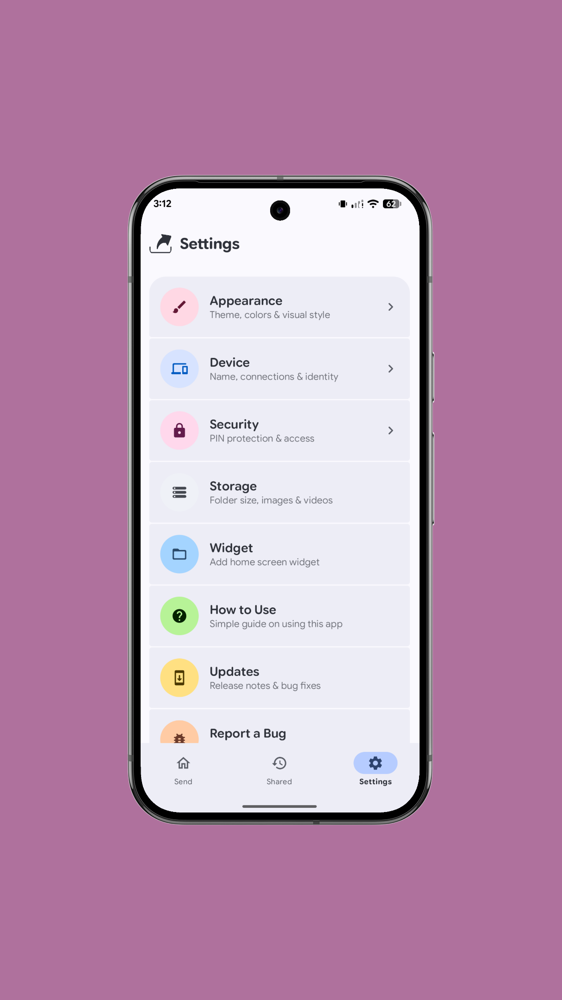
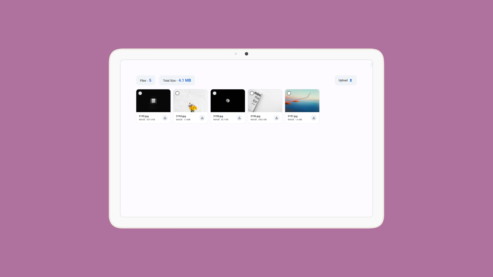
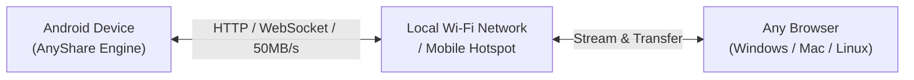

  
  <h1>AnyShare</h1>
  
<strong>Blazing-fast, private local Wi-Fi file sharing & media streaming for Android. No internet, no cloud, zero tracking.</strong>

  

    
    
    
    
  

---

## ⚡ What is AnyShare?

**AnyShare** turns your Android device into a high-speed local streaming and transfer station. Simply connect your devices to the same local Wi-Fi network (or mobile hotspot), start the server, and browse, download, or stream your library directly from any desktop or mobile browser.

- **Zero Software on PC / Laptop**: Any browser (Chrome, Safari, Edge, Firefox) connects instantly via local IP.
- **100% Offline & Off-Grid**: Transfers run over your local Wi-Fi router or phone hotspot at direct network speeds — zero internet data usage.
- **No Cloud Middlemen**: Your personal photos, videos, and documents stay strictly inside your physical room.

---

## 📱 Screenshots

  <table>
    <tr>
      <td align="center" width="25%">
        
         <b>Home & Server Control</b>
      </td>
      <td align="center" width="25%">
        
         <b>Shared Library</b>
      </td>
      <td align="center" width="25%">
        
         <b>Security & Settings</b>
      </td>
      <td align="center" width="25%">
        
         <b>Browser Desktop UI</b>
      </td>
    </tr>
  </table>

---

## ✨ Key Features

- **🚀 Blazing Transfer Speeds**: Peer-to-peer Wi-Fi throughput up to 50 MB/s without cable or Bluetooth bottlenecks.
- **🖥️ Universal Web Interface**: Clean, dark-mode browser portal for laptops and PCs with file previews, search, and batch downloads.
- **🎬 In-Browser Media Streaming**: Stream 4K video and music without downloading, complete with letterbox scaling and audio track switching.
- **📋 Bi-directional Clipboard Sync**: Live clipboard synchronization — send text from phone to laptop or paste from laptop directly to phone.
- **📥 Drag & Drop File Uploads**: Drag files from your computer screen directly into the browser to upload them to your phone.
- **🔒 Privacy by Design**:
  - Uses native Android Photo & Document Pickers (no broad gallery/storage permissions needed).
  - Optional 4-digit security PIN to lock access to authorized devices.
  - Optional hardware-accelerated **AES-256-GCM** encryption.
- **🔋 Screen-Off Stability**: Robust foreground service with `WifiLock` and partial wake lock prevents Android battery savers from dropping connections mid-transfer.

---

## 🛠️ How It Works

```mermaid
graph LR
    Phone["Android Device<br/>(AnyShare Engine)"]
    Router["Local Wi-Fi Network<br/>/ Mobile Hotspot"]
    Laptop["Any Browser<br/>(Windows / Mac / Linux)"]

    Phone <-->|HTTP / WebSocket / 50MB/s| Router
    Router <-->|Stream & Transfer| Laptop
```

1. **Start AnyShare**: Open the app on your phone and tap **Start Server**. The app displays your local URL (e.g., `http://192.168.0.237:8080`).
2. **Open in Browser**: On your laptop, PC, or tablet, open your browser and navigate to the URL.
3. **Stream & Share**: Click any video or photo to stream instantly, download single files or full zip archives, and drag-and-drop to upload.

---

## 💻 Tech Architecture

| Component | Implementation |
|---|---|
| **Platform** | Native Android (API 26+ / Android 8.0 to Android 15+) |
| **Language** | 100% Kotlin |
| **UI Framework** | Jetpack Compose + Material 3 Design System |
| **Async & Flow** | Kotlin Coroutines + StateFlow / SharedFlow |
| **Local Web Engine** | High-performance embedded HTTP socket server with range requests |
| **Media Engine** | Media3 ExoPlayer & HTML5 Web Audio/Video API |
| **Encryption** | Web Crypto API + Java Cryptography Extension (AES-256-GCM) |
| **Web Frontend** | Vanilla HTML5, CSS3 Glassmorphism, Modern ES6+ JavaScript |

---

## 📥 Installation

1. Grab the latest APK from the [Releases](https://github.com/Kaifazad/AnyShare/releases/latest) section.
2. Open the `.apk` on your Android device and confirm installation.
3. Launch AnyShare and start sharing!

---

## 👤 Author

**Kaif Azad**
- GitHub: [@Kaifazad](https://github.com/Kaifazad)
- Instagram: [@kaif.azad](https://instagram.com/kaif.azad)
- Website: [kaifazad.in](https://kaifazad.in)

---

## 📄 License

Distributed under the Apache License 2.0. See [LICENSE](LICENSE) for details.
